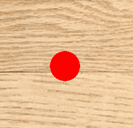

# Replicating the spider bias

>*Despite widespread claims to the contrary, the human mind is not worse than rational . . . but may often be better than rational.* (Cosmides and Tooby, 1994)

***

Tenants of evolutionary psychology have argued that **cognitive biases are not flaws, but often well-adapted features of organisms** who have faced the same problems in their environment throughout their evolutionary history. For instance, it may be advantageous to overdetect predators, whereas it is very costly to underdetect them. This is predicted by **Error Management Theory** (EMT; Haselton & Buss, 2000), which is an application of the Signal Detection Theory to cognitive mechanisms that include noise or incertitude and for which the costs of the type of error (i.e. false alarm or missed detection) are not equal.

In a 2013 article, Witt & Sugovic found that **we tend to inflate the speed of an approaching spider compared to a ball or a ladybug**; it may be adaptive as it increases our preparation time for action (e.g. fighting or fleeing).


*Results obtained by Witt & Sugovic, 2013*

I intend to replicate their experiment, with some minor changes:

- I won't implement their second factor, which was the size of the paddle used by the participants to block the incoming object (the threat to block and the size of the paddle acted independently from each other);
- in their experiment, they used a downward-facing projector to display the stimuli on a table; as I can't afford to use one, I will try to replicate the effect using a standard computer screen and Expyriment;
- in their experiment, they used a picture of a real spider; it may be interesting to **add some schematic representations of spiders to see if the bias is still there** (if it is, it may strenghtens the view that we possess some kind of "spider template", as found in infants by Rakison & Derringer, 2007), and to use other types of insect (which inspire disgust or not; which may harm us or not)
- it may be interesting to **see if this effect is modulated by fear of spiders**

To sum it up, in the present experiment, **participants will have to rate the speed of different objects coming towards them**. We expect **a main effect of Object type: the speed of the spider (real or schematic) will be inflated compared to other objects**.  We also expect **an interaction between Fear of spiders and Object type (the stronger the fear, the stronger the bias)**.

## The design of the experiment

The experiment consists in three parts:

- the **training part**, where the participant familiarizes with the two extreme speeds (the lowest and the highest) by looking at the movements of a simple circle
- the **test part**, where the participant has to juge, in each trial, the speed of one of the two objects; there are 28 trials (7 speeds seen twice x 2 object types)
- the **Fear of Spiders Questionnaire** (18 items)

## How to run the project

1) Clone the repository on your computer using a terminal
2) Launch the program from your terminal: it takes two argument (the objects you want to compare)

*E.g. if you want to compare the evaluation of the speed of a spider and of the speed of a fly, type:* "python Spider_bias.py tegenaria_domestica.png musca_domestica.png"

3) The data are stored in a *.xpd* file in the folder Data.

Thanks to a simple loop seen in class, I was able to anticipate a possible mistake while entering the arguments.

```
if len(sys.argv) < 3 or len(sys.argv) > 3:
	print("")
	print("Usage: you need to enter two arguments - the two objects you want to compare - to run this program.")
	print("The arguments need to be .png file of the repository")
	print("")
	print("Example: python Spider_bias.py tegenaria_domestica.png musca_domestica.png")
	sys.exit()
else:
	list_object = []
	list_object.append(sys.argv[1])
	list_object.append(sys.argv[2])
```

## Creating the stimuli

All the pictures were found on Google image and were free of rights. The logiciel [Gimp](https://www.gimp.org/fr/) was used to trim each picture from its background.

### Creating the background

As I could not use a downward-facing projector, **I had to give the impression to the participant that he or she was looking down at the floor**. In order to do that, I decided to create for each trial a [Canvas](https://docs.expyriment.org/expyriment.stimuli.Canvas.html) with a floor and the picture of neutral legs in blue jeans.

The code was very simple, I just had to create the Canvas and to plot the pictures on it.

```
toile_pieds = expyriment.stimuli.Canvas(size=(1000,800), colour=(255,255,255))
sol = expyriment.stimuli.Picture('plancher.png')
sol.plot(toile_pieds)
feet_pic = expyriment.stimuli.Picture('feet.png', position=(0, -245))
feet_pic.plot(toile_pieds)
```


*The background on which the objects moved during the experiment*

### Finding the objects to animate

I decided to use different sorts of insects (e.g. dangerous or harmless ones, disgusting or not). The schematic spider drawings were found in the Material of Rakinson & Derringer (2007).


*The picture of a spider used in the experiment ("Tegenaria domestica", the kind that hides in our basements in Europe)*

## Making the objects move

I needed, for each trial, to **make the object move as if it were alive**. I thus designed a function to calculate the positions of the object.

```
def calc_pos(ancient_pos, verti_move, limit_verti):
	"""Defines the new position of a stimulus, whith a random horizontal movement and a fixed vertical one. 
	   When the stimulus crosses a fixed point on the y axis, the object makes a diagonal depending on which side
	   of the screen it was on the x axis.
	
	Args
	- ancient_pos(tuple): the previous position of the stimulus on the x and y axis
	- verti_move (int): the nb of pixel for the verti movement (i.e. the speed of the stimulus)
	- limit_verti (int): limit on the y axis for the stimulus to choose a side (left or right)
	
	Returns: the new position of the stimulus (tuple) and the degree of the rotation to apply to the stimulus (int)"""
  ```
  
At first, I tried to use the *"Move"* function of Expyriment, but I did not succeed to implement it on a Canvas so I decided to implement it directly in the function. 

The vertical move corresponds to the speed of the object, one of the variable of interest in the experiment. Thanks to the *random* function, I managed to give a random horizontal move to the stimuli (-5, 0 or 5), in order to make it look like it was moving on its own.

```
new_pos = [ancient_pos[0],(ancient_pos[1] + -1 * verti_move)]
	# translation du stimulus sur l'axe des y
	random_hori_move = random.randrange(-5,6,5)
```

The stimulus also had to rotate in the horizontal direction it was going to, for the movement to be more realistic

```
degree_rotation = random_hori_move
new_pos[0] += random_hori_move
```

The last block of code was used only if the stimulus was approaching the feet in the background picture; when it crosses the threshold, the stimulus chooses the side of the screen in which it was to move diagonally.

```
if new_pos[0] >= 0:
		# si le stimulus était dans la partie droite de l'écran
			new_pos[0] += 5 * (verti_move//5)
			#le stimulus part à droite
			degree_rotation = 7 + (verti_move//5)
else:
		# si le stimulus était dans la partie gauche de l'écran
			new_pos[0] += -1 * (5 * (verti_move//5))
			#le stimulus part à gauche
			degree_rotation = -7 - (verti_move//5)
```

And the function simply returns the new position of the object and the rotation to apply to it.

```return new_pos, degree_rotation```


*An example of position of the spider*

## Creating a Likert scale

I needed my participants to answer on this kind of scale when:
- they judged the speed of the object in each trial
- they answered the Fear of Spiders Questionnaire at the end of the experiment

Therefore, **writing a function with adjustable parameters was very useful**. 

However, as I was working with Canvas objects, I did not manage to use the [TouchScreenButtonBox](https://docs.expyriment.org/expyriment.io.TouchScreenButtonBox.html) of Expyriment.

```
def Likert_scale(N, legendes, questions):
	"""Draws a Likert scale with buttons and text for legend and questions
	
	Args:
		- N (int): nombre de points sur l'échelle (doit être impair: 5, 7, etc.)
		- legendes (list of strings): légendes à rajouter pour chaque case (ex: un peu d'accord, d'accord...)
		=> N et legendes permettent de créer l'échelle
		- questions (list of strings): liste de questions à poser au participant 
		=> questions permet de créer le questionnaire
	Returns: chaque question rentrée avec l'échelle correspondante (list of canvas), les positions des boutons de réponses 		(list of tuples), le rayon des boutons de réponse (int), la position du bouton submit (tuple)
	"""
```
Firstly, I had to place the response buttons on the x-axis. I just had to compute the extreme points of the scale and to multiply them by the relative distance between the circles. I then added each position in a list.

```
extremite_echelle = int((N - 1)/2)
	#e.g. si l'échelle est à 7 points, on obtient 3 (l'échelle va de -3 à 3)
	distance_cercles = 700/N
	#on divise une partie de la toile (qui fait 800*600 pixels, voir + bas) par le nombre de points de l'échelle
	list_pos = []
	for i in range(-extremite_echelle, extremite_echelle + 1):
			list_pos.append(int(i * distance_cercles))
			#on calcule, sur l'axe horizontal, les positions des boutons de réponse
```
I then created the buttons stimuli and the legends stimuli.

```
for i in range(N):
			button = expyriment.stimuli.Circle(radius=radius_button, position=(list_pos[i],-50), colour=(0,0,0), line_width=2)
			list_button.append(button)
			text_leg = expyriment.stimuli.TextBox(legendes[i], position=(list_pos[i],0), size=(100, 50))
			list_text_leg.append(text_leg)
			#création des boutons de réponse avec leurs légendes
```

In the last block of code, I create a Canvas object for each question. I then plot on it the buttons, the legends, the question and a submit button. Finally, I just have to add each Canvas to a list returned by the function.

```
for i in range(len(questions)):
		toile = expyriment.stimuli.Canvas(size=(800,600), colour=(255,255,255))
		for elt in list_button:
			elt.plot(toile)
		for elt in list_text_leg:
			elt.plot(toile)
		text_question = expyriment.stimuli.TextBox(questions[i], position=(0,100), size=(700, 50), text_colour=(0,0,0))
		text_question.plot(toile)
		ok = expyriment.stimuli.Picture('ok.png', position=(pos_submit_button))
		ok.plot(toile)
		list_can.append(toile)
		#ajout pour chaque question d'une toile, et sur chaque toile de l'échelle, de la question, et d'un bouton pour valider ('ok.png')
```

The function returns the list of Canvas to display, the positions of the buttons, their radius and the position of the submit button. It will be quite useful as I will need to check whether the participant clicked on the button to determine his or her answer.

```
return(list_can, list_pos, radius_button, pos_submit_button)
```


*The Likert scale in the test part (see below)*

## The training part

After the instructions, the participants see twice the two extreme speeds (the slowest and the fastest).

```
speeds_training = [10, 70]
# les sujets ne voient pendant l'entraînement que les deux vitesses extrêmes
for i in range(0, 2):
	for speed in speeds_training:
		speed_to_display = "Vitesse " + str(speed//10)
		text_speed = expyriment.stimuli.TextScreen(speed_to_display, "\nObservez attentivement le cercle se déplacer à la "+ speed_to_display + "\n\n(Appuyez sur une touche pour continuer)")
		text_speed.present()
		exp.keyboard.wait()
```

For the training part to be neutral, the object was a red circle moving through the screen, whose position was calculated with the function *calc_pos* presented above.

```
		pos_circle = [0,400]
		while pos_circle[1] >= -350:
			pos_circle, deg_rot = calc_pos(pos_circle,speed,-75)
			toile_pieds = expyriment.stimuli.Canvas(size=(1000,800), colour=(255,255,255))
			sol = expyriment.stimuli.Picture('plancher.png')
			sol.plot(toile_pieds)
			feet_pic = expyriment.stimuli.Picture('feet.png', position=(0, -245))
			feet_pic.plot(toile_pieds)
			dot = expyriment.stimuli.Circle(radius=25, colour=(255, 0, 0), position=pos_circle)
			dot.plot(toile_pieds)
			toile_pieds.present()
			exp.clock.wait(1)
			#fait bouger le cercle pour chacune des deux vitesses, deux fois
```




*The dot used to anchor the two extreme speeds in the training part*

## The test part

For each object, the participants see the 7 speeds twice, in a randomized order.

```
for object in list_object:
	speeds = [10, 20, 30, 40, 50, 60, 70] * 2
	random.shuffle(speeds)
```

The code is then the same as in the training part, the position of the object being calculated according to his speed every millisecond, until it is off the screen (-350 on the y-axis).

```
while pos_pic[1] >= -350
```

After each presentation of the object at a determined speed, the participant has to rate the speed on a 7 points Likert scale. the code is a little long, as it needs to:

- **know where the participant clicked**

```
		toile = questionnaire[0]
		toile.present()
		expyriment.io.Mouse(show_cursor=True)
		has_clicked_button = 0
		has_clicked_submit = 0
		while has_clicked_submit == 0:
			pos = exp.mouse.wait_press()
			pos_tuple = pos[1]
			#enregistre la position cliquée par le participant
```

- **mark the button where the participant clicked**

N.B.: it implies to know if the mouse was on one of the response buttons, thanks to a *for loop* on the buttons' positions, taking into account their radius.

```
			if has_clicked_button == 0:
			#si le participant clique pour la première fois dans un des boutons
				for elt in position_cercles:
					if pos_tuple[0] < elt + rad_button and pos_tuple[0] > elt - rad_button:
						if pos_tuple[1] < -50 + rad_button and pos_tuple[1] > -50 - rad_button:
						#si le participant a cliqué sur un des boutons
							circle_first_rep = expyriment.stimuli.Circle(radius=5, position=(elt, -50), colour=(0, 0, 255))
							circle_first_rep.plot(toile)
							#remplit le bouton cliqué d'un cercle bleu
							ancient_pos_clicked = (elt, -50)
							has_clicked_button += 1
							toile.present()
```
					
- **possibly correcting the first answer of the participant (by clearing the first one and marking the new button)** 

```
			elif has_clicked_button != 0:
			#si le participant a déjà répondu une fois
				for elt in position_cercles:
					if pos_tuple[0] < elt + rad_button and pos_tuple[0] > elt - rad_button:
						if pos_tuple[1] < -50 + rad_button and pos_tuple[1] > -50 - rad_button:
							circle_to_del = expyriment.stimuli.Circle(radius=rad_button, position=(ancient_pos_clicked), colour=(255,255,255), line_width=0)
							circle_to_del.plot(toile)
							ancient_circle = expyriment.stimuli.Circle(radius=rad_button, position=(ancient_pos_clicked), colour=(0,0,0), line_width=2)
							ancient_circle.plot(toile)
							#restaure l'ancien bouton cliqué à son état initial
							circle_has_rep = expyriment.stimuli.Circle(radius=5, position=(elt, -50), colour=(0, 0, 255))
							circle_has_rep.plot(toile)
							#remplit le nouveau bouton cliqué d'un cercle bleu
							toile.present()
							ancient_pos_clicked = (elt, -50)
```

- **move to the next trial of the participant has validated his answer**

```		
				if pos_tuple[0] < (pos_sub[0] + rad_button) and pos_tuple[0] > (pos_sub[0] - rad_button):
					if pos_tuple[1] < (pos_sub[1] + rad_button) and pos_tuple[1] > (pos_sub[1] - rad_button):
						has_clicked_submit += 1
						#si le sujet clique sur le bouton valider, on passe à la question suivant
						
```

- **save the actual speed of the object and the subjective evaluation of the same speed by the participant** 

```
						score = (int(ancient_pos_clicked[0]/100 + 4))
						#permet de passer des positions des cercles (-300, -200, etc.) aux points (de 1 à 7 ici)
		exp.data.add([object, (speed //10), score])
	
```

## The questionnaire part

The *Fear of Spiders Questionnaire* (FSQ; Szymanksi & O’Donohue, 1995) contains 18 items, for which participants have to answer on a seven-point Likert scale. It has proven to be sensitive to non-phobic fears of spider (Muris & Merckelbach, 1996), which is the reason why I have decided to use it in my experiment.

I translated the questionnaire in french, and put the questions in a *.txt* file. Then, thanks to the *Likert_scale* function I wrote for the speed evaluation part, **I simply had to read the *.txt* file and to put the questions in a list**.

```
question_file = open('questionnaire.txt')
lignes = question_file.readlines()
list_question = []
for elt in lignes:
	list_question.append(elt)
question_file.close()
#ajout de chaque question du questionnaire sur la peur des araignées dans une liste
```
The code which allowed the participant to answer is the same than in the training part. The total score of the questionnaire (ranging from 18 to 126) is also saved in the *.xpd* file, after the speed evaluations.

```
score_quest = sum(list_score_quest)
exp.data.add(["Score questionnaire", score_quest])
```

## Bibliographie

Cosmides, L., & Tooby, J. (1994). Better than Rational: Evolutionary Psychology and the Invisible Hand. *American Economic Review*, 84(2), 327-332.

Haselton, M. G., & Buss, D. M. (2000). Error management theory: A new perspective on biases in cross-sex mind reading. *Journal of personality and social psychology*, 78(1), 81-91.

Krause, F. et Lindemann, O. (2014). Expyriment: A Python library for cognitive and neuroscientific experiments. *Behavior Research Methods*, 46(2), 416-428.

Rakison, D. H., & Derringer, J. (2008). Do infants possess an evolved spider-detection mechanism? *Cognition*, 107(1), 381-393.

Szymanski, J. and O’Donohue, W. (1995). Fear of spiders Questionnaire. Journal of Therapy and Experimental Psychiatry*, 26(1), 31-34.

Witt, J. K., & Sugovic, M. (2013). Spiders appear to move faster than non-threatening objects regardless of one's ability to block them. *Acta Psychologica*, 143(3), 284–291.

## What I learned from this course

### My previous coding experience

Before the course, I had followed a one-semester introductory course on Python. I thus knew the basics of the language (how to use a loop, how to build a function, and so forth), but I had never worked on a precise library before (such as Expyriment) nor had I written a full-scale functioning program.

### What I learned from this course

I feel like the course gave us a fantastic **toolbox** to use in our future projects: Pygame, Expyriment, Github, github.io, Pandas, the PCBS ressources and Automatetheboringstuff... Furthermore, we also learned about **good scientific practices**: the clarity of the code, the availability of the data and of the material used in the experiment (thanks to Github, for instance).

### What I still got to learn

I still have a lot to learn. For instance, I didn't used Expyriment in the most efficient way (I basically recoded the TouchScreenButtonBox as I didn't manage to use it whith a Canva object, and I didn't use the *"move"* function to move the stimuli). Also, my code could have been shorter and clearer.

In the future, I would like to start using *R* for statistics and get familiarized with Matlab. I also intend to deepen my knowledge in Python - finishing Automatetheboringstuff would be a pretty good start!
